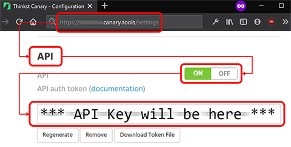

The `consoleapi` input module fetches alerts by periodically hitting the console's /incidents API endpoint.  
Additionally, this module ACKs incidents, if configured to do so, once they have been received successfully by the destination.  
  
More details about the console API can be found here: [Canary Console API Docs](https://docs.canary.tools/console-settings/api.html)  

|Flag|Type|Environment Variable|Description
|---|---|---|---|
|`-apikey`|string| CANARY_APIKEY|console API Key|
|`-domain`|string| CANARY_DOMAIN|canary console domain|
|`-tokenfile`|string| CANARY_TOKENFILE|the token file 'canarytools.config' which contains api token and the domain|
|`-interval`|int| CANARY_INTERVAL|alert fetch interval 'in seconds'|

# The canary console token file
Instead of setting the `apikey` and `domain` using command line flags, or through environment variables, you can download the token file 'canarytools.config' from your console's settings page, then do one of the following: 
- provide that using the `-tokenfile` flag,
- set CANARY_TOKENFILE environment variables, or
- simply place it in your user's home directory and ChirpForwarder will look for it there.  
***  
To get the token file, click on "Download Token File":  

